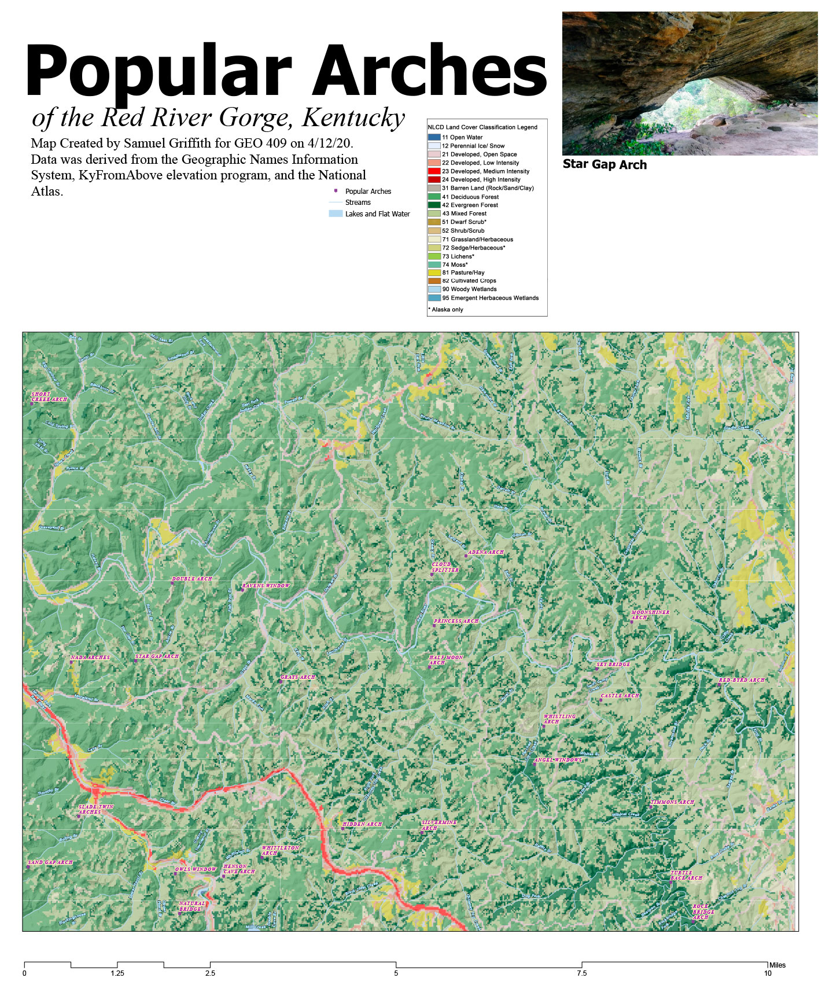
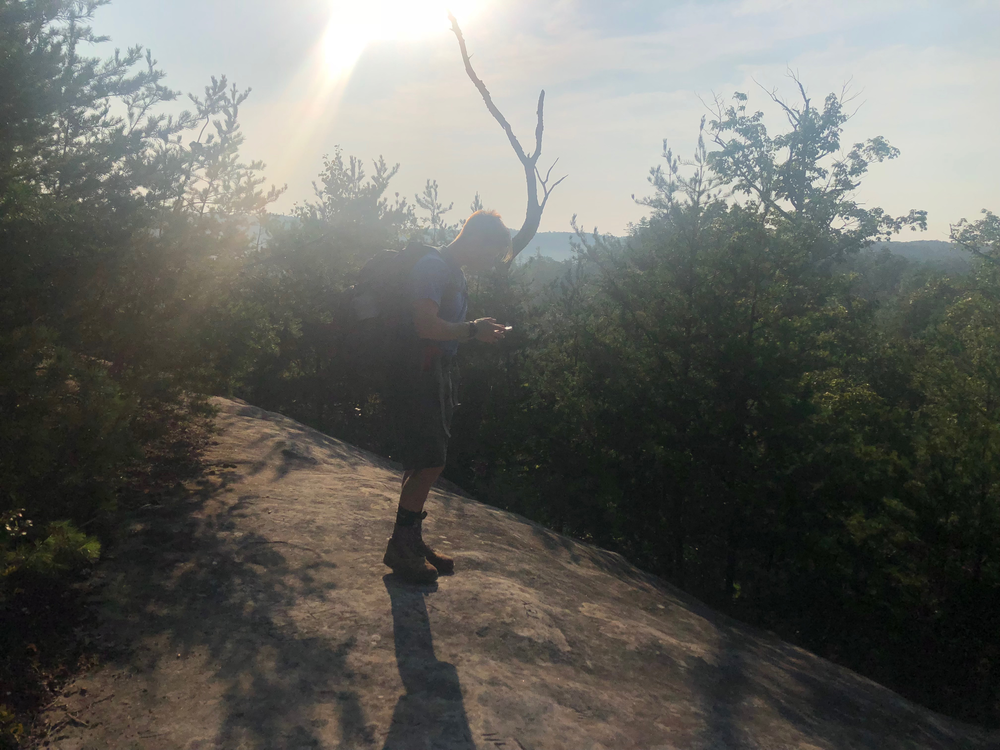
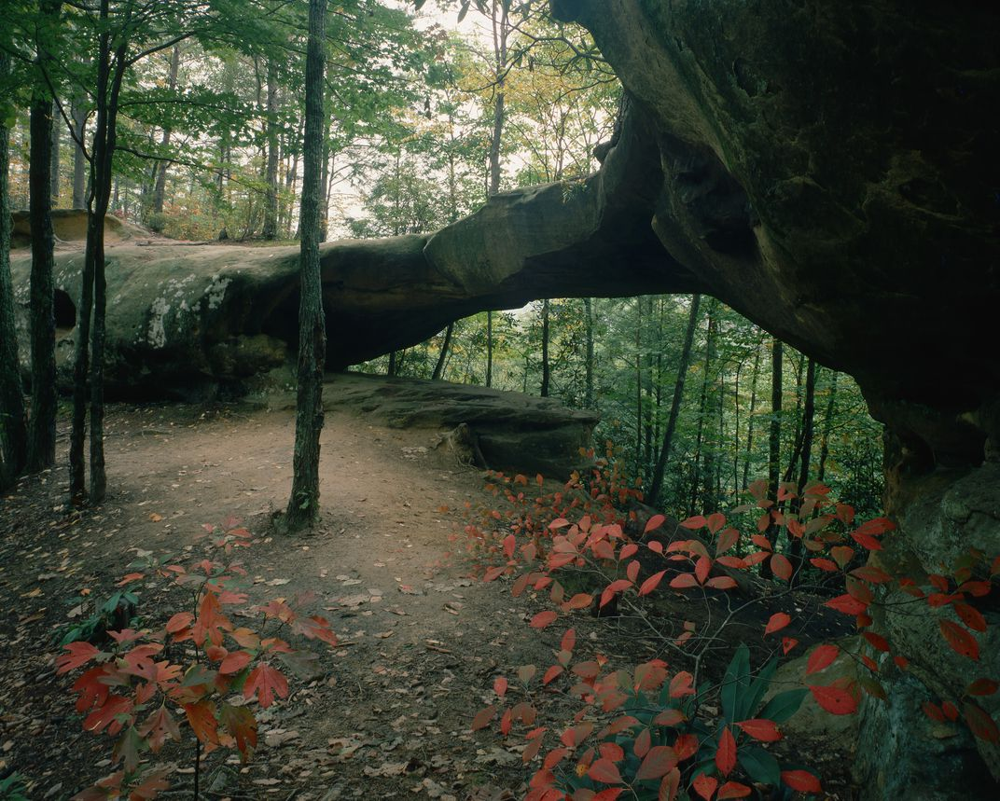
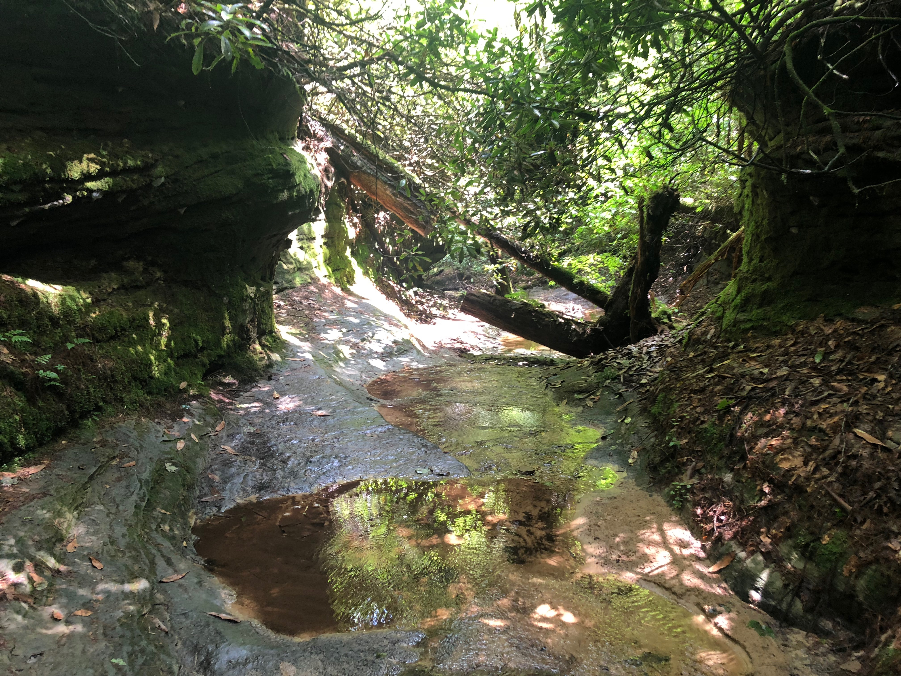

# rrg
Kentucky's Red River Gorge national Geological Area
## A Base map of arches
[Download a GeoPDF of arches](https://scgr225.github.io/rrg/basemap/rrg.pdf)

    
*Preview of map*

## Visit web page

[scgr225.github.io/rrg](https://scgr225.github.io/rrg)

## Photographs of Red River Gorge

Cliff at the Red River Gorge by Samuel Griffith

Arch in the Clify Wilderness by Samuel Griffith

Stream found while hiking the Red River Gorge by Samuel Griffith

